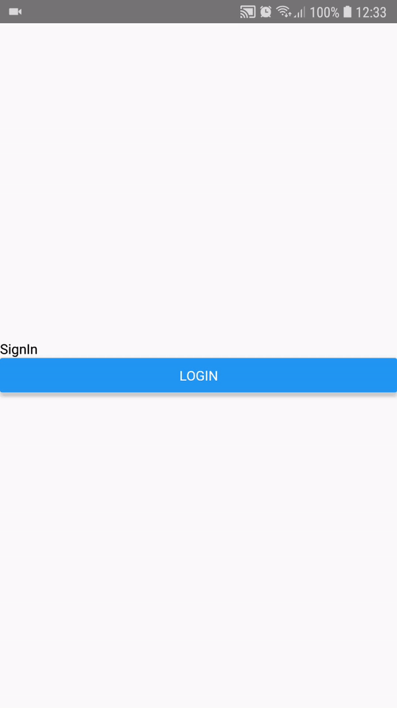
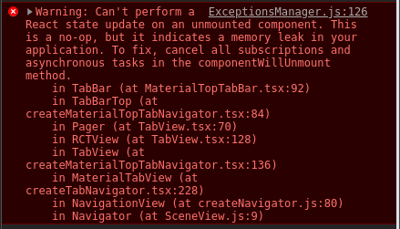

- Android 8.0
- Ubuntu 18.04 LTS
- react-navigation "^4.0.10",
- react-navigation-tabs "^2.6.2"

Install dependencies

```console
yarn
```

Install app.

```console
react-native run-android
```

Click couple of times in login and logout and wait with debugger opened.

Real time: 92 seconds.
Gif time: 47 seconds. 




